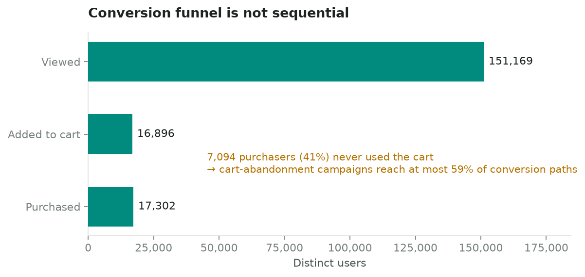
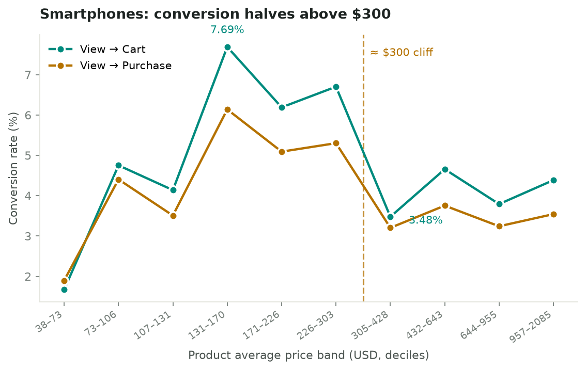
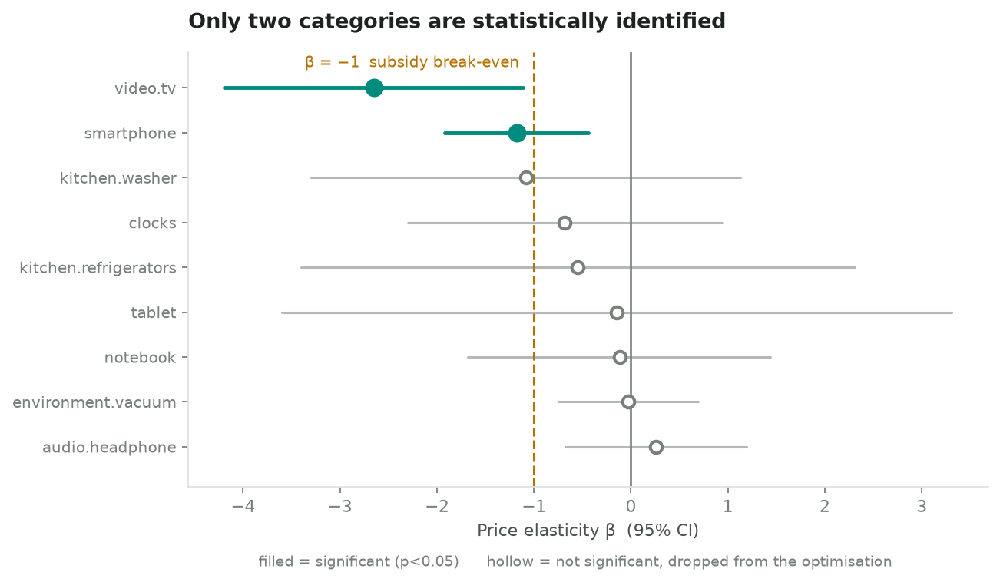
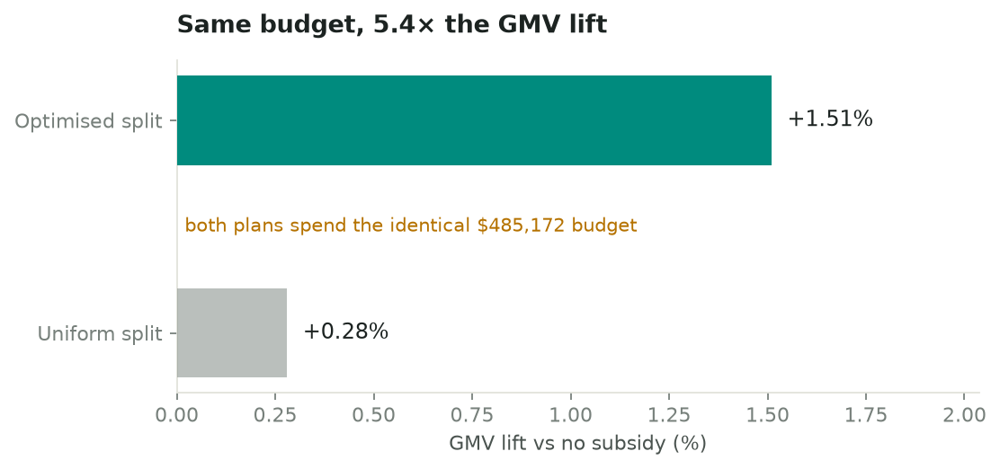
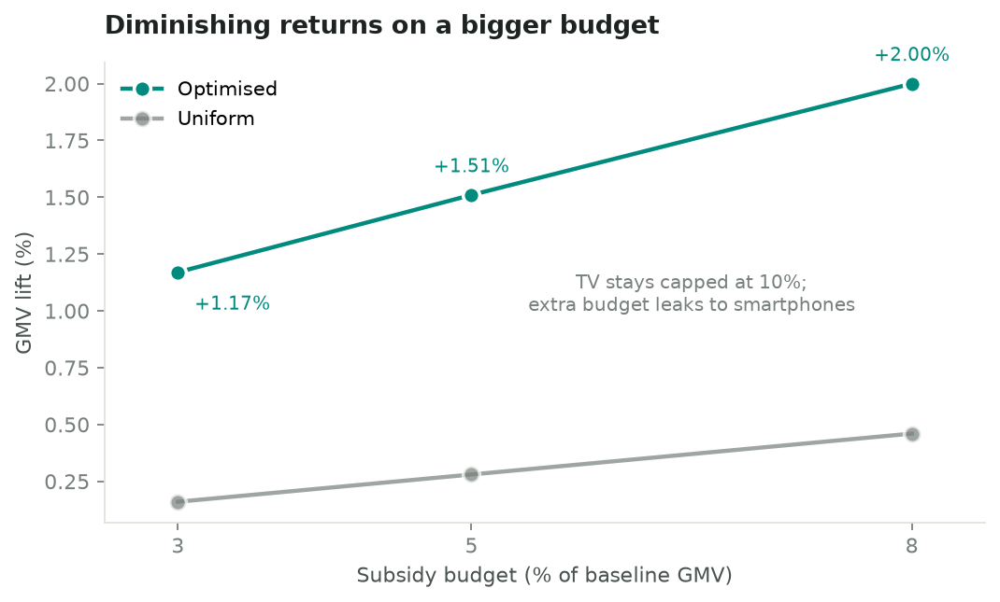
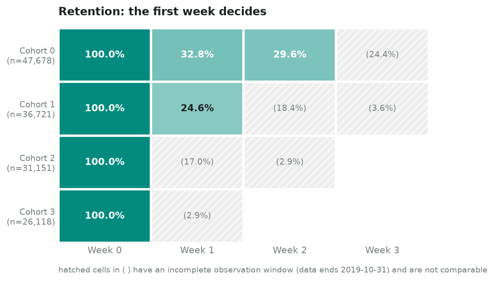
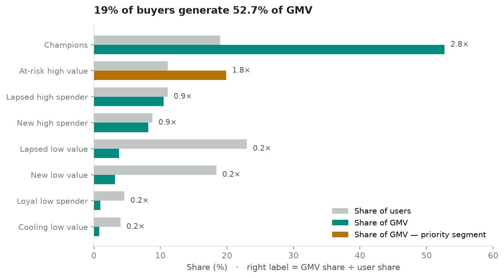

# 电商用户行为与定价策略分析

> 用 4,244 万条电商行为日志回答三个问题：**用户在哪一步流失、价格影响有多大、一笔补贴预算该怎么花。**
> *Analysing 42.4M e-commerce events to locate conversion drop-off, quantify price elasticity, and optimise subsidy allocation.*

**技术栈**：SQL (SQLite) · Python (pandas / statsmodels / scipy / matplotlib)
**完整总结（中英双语）**：[PROJECT_SUMMARY.md](PROJECT_SUMMARY.md)

---

## 核心结论

| # | 发现 | 数字 |
|---|---|---|
| 1 | 转化漏斗并非串行结构，购物车召回策略覆盖不全 | **41%** 的买家从未使用购物车 |
| 2 | 智能手机品类存在价格断崖 | 越过 **$300** 后加购转化率 6.70% → **3.48%** |
| 3 | 品类间价格弹性相差 11 倍 | 电视 −2.65 / 手机 −1.18 / 其他 −0.24 |
| 4 | 最优补贴分配效率远高于均匀分配，但整体 ROI 不足 | +1.51% vs +0.28%（**5.4×**），整体 ROI 仅 **0.30** |
| 5 | 目标函数决定结论 | GMV 方案需付出 **18.5% 毛利**换 1.51% GMV |
| 6 | 用户价值高度集中 | **19%** 的买家贡献 **52.7%** 的 GMV |

**核心建议**：不做全品类价格补贴，把补贴从「价格策略」改为「定向策略」——横向集中到高弹性品类，纵向集中到 1,924 名高价值流失预警用户；高价商品改用分期免息、以旧换新等不侵蚀毛利的转化手段。

---

## 关键图表

### 转化漏斗不是串行的

17,302 名下单用户中有 7,094 人从未使用购物车，现行购物车召回策略最多覆盖六成成交路径。

### 智能手机的价格断崖

固定品类以排除构成效应后，客单价越过约 $300，浏览转加购率由 6.70% 骤降至 3.48%。

### 只有两个品类的弹性统计上站得住

商品固定效应回归 + 按商品聚类的稳健标准误。九个品类中七个因样本不足被明确剔除，未硬报结果。

### 同样的预算，优化分配是均匀分配的 5.4 倍


### 但预算的边际回报迅速衰减

电视始终顶在 10% 补贴上限，多出的预算只能流向弹性不足的手机品类，边际 ROI 仅 0.17。

### 新用户的生死线在第一周

斜纹格子表示观察窗口不完整（数据止于 2019-10-31），不可横向比较。

### 19% 的买家贡献 52.7% 的 GMV

橙色为「高价值流失预警」人群：1,924 人，人均消费为大盘 1.8 倍，但平均已 20 天未购买。

---

## 方法要点

**哈希抽样而非随机抽行。** 按 `user_id` 的 md5 哈希抽取 5%，保证单个用户的「浏览—加购—下单」行为链完整。按行随机抽样会切碎行为链，使漏斗、留存、RFM 全部失真。

**商品固定效应识别价格弹性。** 弹性仅由同一商品自身在不同时间的价格变动识别，「贵商品天生受众更窄」这类固有差异被完全吸收，排除构成偏差。等价于对每个商品做组内去均值——本项目用玩具数据与手动去均值双重验证过该等价性。

**按商品聚类的稳健标准误。** 同一商品相邻几天的需求存在惯性，假设观测独立会低估标准误、高估显著性。

**优化模型交叉验证。** SLSQP 首次求解在初值处误判收敛，原因是目标函数（10⁷ 量级）与决策变量（0–0.1）量纲相差过大；归一化后重解，并用暴力网格搜索交叉验证。

**双目标检验。** 分别以最大化 GMV 与最大化毛利求解，并推导出补贴划算的临界条件 |β| > 1/毛利率。

---

## 目录结构

```
├── PROJECT_SUMMARY.md          项目总结（中英双语）
├── AB_TEST_DESIGN.md           A/B 实验设计方案
├── sql/                        六个 SQL 模块
│   ├── 01_data_quality.sql       数据质量体检
│   ├── 02_basic_metrics.sql      DAU、周内波动、Top10 品类
│   ├── 03_funnel.sql             转化漏斗与用户行为标记表
│   ├── 04_price_band.sql         价格带转化（含品类内对照）
│   ├── 05_cohort_retention.sql   同期群留存宽表
│   └── 06_elasticity_panel.sql   商品 × 日期弹性面板
├── scripts/                    Python 脚本
│   ├── sample_ecommerce_data.py  哈希抽样
│   ├── build_db.py               建 SQLite 库与索引
│   ├── run_sql.py                SQL 执行工具
│   ├── day2_elasticity.py        价格弹性（商品固定效应）
│   ├── day2_optimize.py          补贴分配优化（GMV 目标）
│   ├── day2_optimize_profit.py   目标函数敏感性（毛利目标）
│   ├── day2_rfm.py               RFM 用户分群
│   └── day3_charts.py            生成七张图表
├── output/                     图表与结果表
└── data/                       数据目录（不入库，见下）
```

## 如何复现

数据文件未纳入版本控制（`ecommerce.db` 约 463 MB，超过 GitHub 单文件上限）。复现步骤：

```bash
# 1. 从 Kaggle 下载 2019-Oct.csv（数据集见下方来源）放入 data/
# 2. 哈希抽样至 5%
python3 scripts/sample_ecommerce_data.py \
    --input data/2019-Oct.csv --output data/sample_2019_oct.csv.gz --pct 5

# 3. 建库
python3 scripts/build_db.py

# 4. 依次运行分析
python3 scripts/day2_elasticity.py
python3 scripts/day2_optimize.py
python3 scripts/day2_optimize_profit.py
python3 scripts/day2_rfm.py
python3 scripts/day3_charts.py
```

依赖：`pandas numpy statsmodels scipy matplotlib`

## 数据来源

Kaggle — [eCommerce behavior data from multi category store](https://www.kaggle.com/datasets/mkechinov/ecommerce-behavior-data-from-multi-category-store)（作者 Michael Kechinov），本项目使用 2019 年 10 月分区。

## 已知局限

价格弹性基于观察性数据，商品固定效应无法排除随时间变化的混淆因素，结论定位为方向性参考，落地需 A/B 实验验证；优化模型假设品类间需求独立，忽略替代效应，GMV 增量为上界；恒弹性假设仅在数据覆盖的价格波动范围内成立；毛利率为外生假设，已做四档敏感性分析；仅一个月数据，无法识别季节性。详见 [PROJECT_SUMMARY.md](PROJECT_SUMMARY.md)。
